# Relatório: Algoritmos Genéticos

## Introdução

Os algoritmos genéticos são métodos de busca e otimização baseados nos princípios de seleção natural e evolução. Muito utilizados na ciência da computação e investigação operacional para resolver problemas comuns complexos que os métodos clássicos não são eficientes. Este relatório tem como objetivo demonstrar os resultados da implementação de tais algoritmos na resolução de um problema.

Todas as implementações foram feitas em Python, utilizando as bibliotecas comuns como Numpy e Matplotlib. Para cada problema, diferentes experimentos com parâmetros foram feitos: crossover, mutação, população e assim por diante.

Os códigos podem sere encontrados nos arquivos `exercicio-1.ipynb`, `exercicio-2.ipynb` e `exercicio-3.ipynb`, e os gráficos gerados estão na pasta `graficos/`.

## Problema 1 - Reconhecimento de padrões.

### Descrição do problema

O algoritmo deve reconhecer o número 0, representado pela bitstring: [1 1 1 1 0 1 1 0 1 1 1 1].

### Tarefas

1. #### Verifique, em média, quantas gerações são necessárias para atingir o alvo.

A **Figura 1** demonstra que, em média são necessárias `6.89` gerações para atingir o alvo, isso utilizando uma população de 200 indivíduos, taxa de crossover de `0.7` e taxa de mutação de `0.02`.

<figure>
  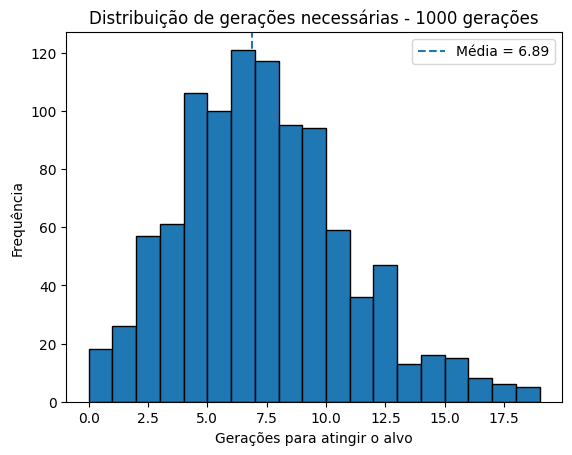
  <figcaption>Figura 1: Distribuição de gerações necessárias</figcaption>
</figure>

2. #### Teste diferentes taxas de crossover e mutação, comparando os resultados.

A **Figura 2** trata sobre o experimento com diferentes taxas de crossover e mutação. É possível identificar que o aumento da taxa de crossover tende a acelerar a convergência, enquanto taxas de mutação mais altas podem levar a uma maior dispersão e dificuldade em encontrar o alvo.

A combinação de taxas de crossover e mutação mais eficaz foi a de `crossover_rate=0.9` e `mutation_rate=0.01`, que apresentou uma média de `6.2` gerações para convergir.

<figure>
  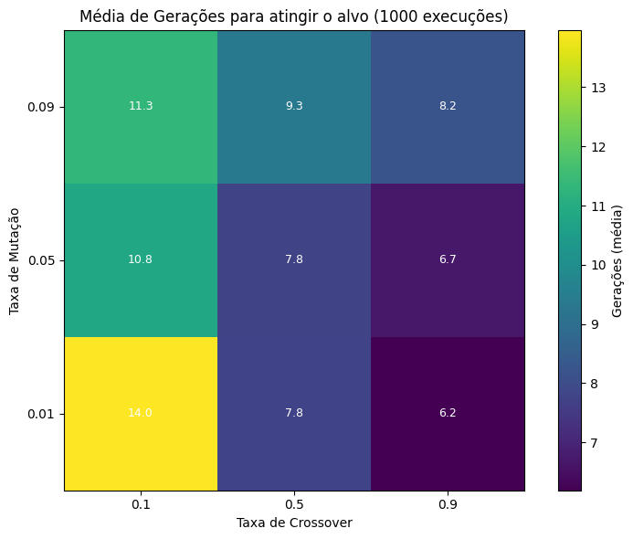
  <figcaption>Figura 2: Comparação de taxas de mutação e crossover</figcaption>
</figure>

3. #### Realize experimentos utilizando apenas crossover e apenas mutação, e compare os resultados obtidos.

A **Figura 3** trata sobre o experimento com apenas crossover (mutação desativada, `crossover_rate=0.7`), a maioria das execuções convergiu em cerca de 5–6 gerações, com média de 4,87 gerações.

Já no cenário de apenas mutação (crossover desativado, `mutation_rate=0.02`), observamos uma convergência muito mais lenta e dispersa: a média foi de `11.27` gerações, com casos chegando a ultrapassar 20 gerações.

O crossover sozinho é bem mais eficiente em recombinar informação útil do que depender unicamente de mutação para guiar a busca. A mutação isolada tende a explorar o espaço de forma menos direcionada, resultando em maior número de gerações para atingir o alvo. Isso reforça a importância de um bom equilíbrio entre operadores em algoritmos genéticos clássicos.

PS: Por algum motivo, as últimas gerações "explodem" mesmo após a convergência, eu não consegui descobri o porque 🥺.

<figure>
  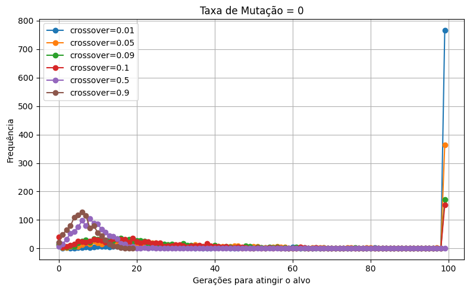
  <figcaption>Figura 3: Sem taxa de mutação, apenas crossover</figcaption>
</figure>

## Problema 2 - Maximização de Função

### Descrição do problema

Implemente um algoritmo genético para maximizar a função, definida por:

$$
g(x) \;=\; 2^{-2\!\left(\frac{x - 0.1}{0.9}\right)^{2}}
\;\bigl(\sin(5\pi x)\bigr)^{6},
\quad x \in [0,1]
$$

A função é definida no intervalo [0, 1] e tem um máximo global em `x=0.1`, onde `g(x)=1`. O gráfico da função é mostrado na **Figura 4**.

<figure>
  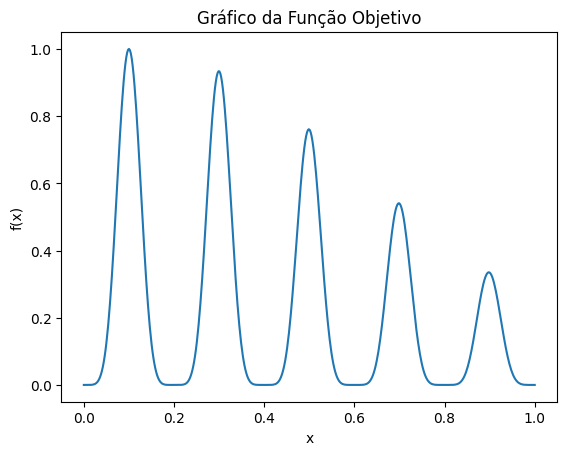
  <figcaption>Figura 4: Gráfico da função objetivo</figcaption>
</figure>

### Tarefas

1. #### Utilize uma representação por bitstring com precisão suficiente para pelo menos três casas decimais.

A **Figura 5** demonstra a convergência do algoritmo genético ao longo das gerações. A média de gerações necessárias para atingir o alvo foi entre `6` e `10` (devido a aleatoriedade), com uma população de 200 indivíduos, taxa de crossover de `0.7` e taxa de mutação de `0.02`.

<figure>
  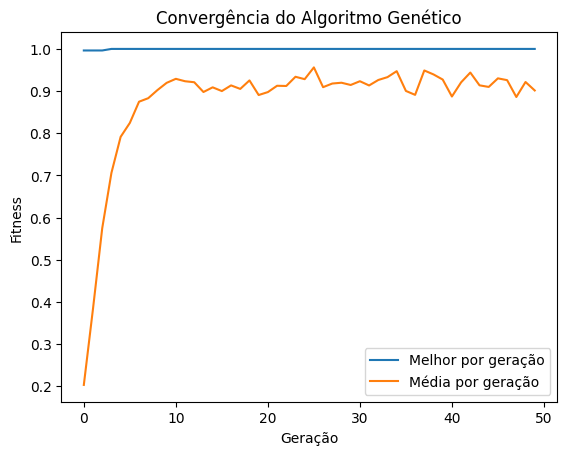
  <figcaption>Figura 5: Convergência do Algoritmo Genético</figcaption>
</figure>

2. #### Considere o alvo como desconhecido e registre os maiores valores obtidos para g(x).

Na **Figura 6** podemos observar uma convergência muito rápida, nas primeiras 5-6 gerações o Algoritmo Genético já sobe de um valor inicial (em torno de `0.998`) até aproximadamente `0.9998`. Isso demonstra que, com uma população pequena (`50`) e resolução de 10 bits, é possível encontrar rapidamente regiões de alto fitnes.

<figure>
  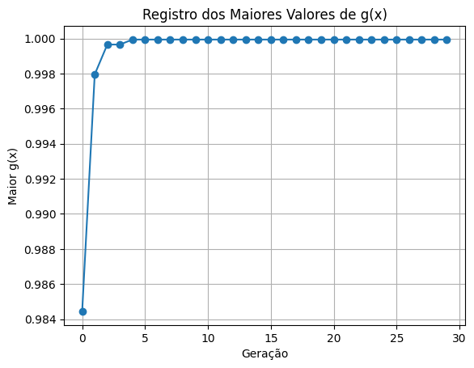
  <figcaption>Figura 6: Registro dos maiores valores de g(x)</figcaption>
</figure>

3. #### Compare os resultados com os obtidos anteriormente utilizando os algoritmos de Subida da Colina e Recozimento Simulado, levando em conta tanto os valores de g(x) quanto os tempos de execução.

Pela Figura 7 pode-se observar que o Algoritmo Genético e recozimento simulado chegam muito perto de $g(x)=1$, ou seja, encontraram o pico global da função. Subida da colina por outro lado, não consegue encontrar o pico global.

Em questão de custo computacional, a Figura 7 ainda demonstra que o Algoritmo Genético, embora igualmente preciso ao recozimento, é muito mais pesado em termos de tempo de execução. O recozimento simulado, por outro lado, é rápido e preciso. Para esse problema, o recozimento simulado é a melhor opção.

<figure>
  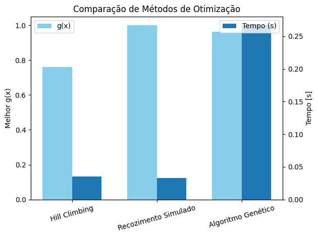
  <figcaption>Figura 7: Comparação dos Métodos de Otimização</figcaption>
</figure>

4. #### Explore diferentes esquemas de seleção (por exemplo, roleta, torneio e amostragem universal estocástica).

A **Figura 8** mostra a comparação entre os métodos de seleção: roleta (Roulette), torneio (tournament) e amostragem universal estocástica (SUS). O método de torneio se destacou, apresentando uma convergência mais rápida e consistente em comparação com os outros métodos.

O método de Roulette e SUS apresentou uma *"desconvergência"* em algumas execuções, o que pode ser atribuído à suas naturezas estocástica, onde indivíduos com fitness mais baixo podem ser selecionados.

<figure>
  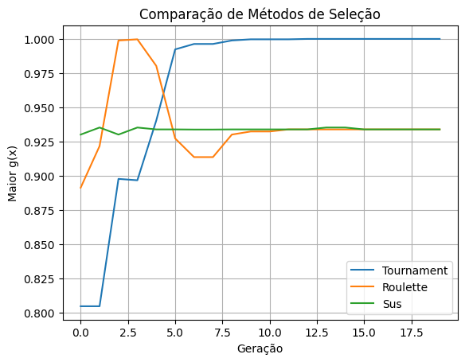
  <figcaption>Figura 8: Comparação dos Métodos de Seleção</figcaption>
</figure>

## Problema 3 - Minimização de Função (Rosenbrock)

### Descrição do problema

Implemente um algoritmo genético para minimizar a seguinte função (geralmente conhecida como função de Rosenbrock):

$$
f(x, y) \;=\; (1 - x)^2 \;+\; 100\,\bigl(y - x^2\bigr)^2,
\quad x, y \in [-10, +10]
$$

A função de Rosenbrock é uma função não convexa frequentemente utilizada como um teste para algoritmos de otimização. O gráfico da função é mostrado na **Figura 9**.

<figure>
  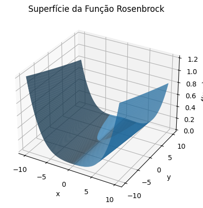
  <figcaption>Figura 8: Superfície da Função Rosenbrock</figcaption>
</figure>

### Tarefas

1. #### Considere o alvo como desconhecido e registre os menores valores obtidos para f(x, y).

A **Figura 9** mostra uma queda brusca inicial entre as gerações 0 e 10. A população parte de valores de $(f)$ muito altos (até ~55) e, nas primeiras gerações já encontramos o "vale" do Rosenbrock (região próxima a \((1,1)\)). Em seguida, observa-se o valor mínimo descendo para em torno de `0.5` e `0.1`. O Algoritmo Genético já está nos arredores do ótimo. A curva vai achatando, mostrando que a pressão seletiva está refinando a solução, mas o progresso é lento.

A **Figura 9** utilizou uma população de 200 indivíduos, taxa de crossover de `0.9` e taxa de mutação de `0.05`. O algoritmo convergiu em média entre `10` e `20` gerações.

<figure>
  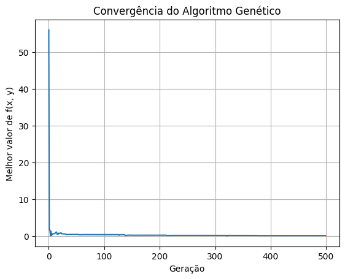
  <figcaption>Figura 9: Convergência do Algoritmo Genético</figcaption>
</figure>

2. #### Teste diferentes tamanhos de população, experimentando versões sem elitismo e com elitismo (com diferentes quantidades de indivíduos).

A **Figura 10** mostra a convergência com diferentes populações e elitismos. Percebe-se que a introdução de elitismo (`2`, `5` e `10` indivíduos) acelera a convergência, especialmente em populações maiores. O elitismo ajuda a preservar boas soluções, evitando que elas sejam perdidas em gerações subsequentes. A população de `200` indivíduos com `10` elitistas convergiu mais rapidamente, atingindo o mínimo global em menos de `5` gerações.

Foi utilizado uma taxa de crossover de `0.9` e taxa de mutação de `0.05`.

<figure>
  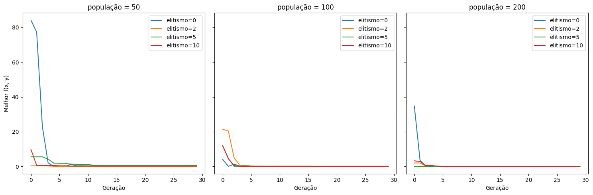
  <figcaption>Figura 10: Convergência Com diferentes populações e elitismos</figcaption>
</figure>