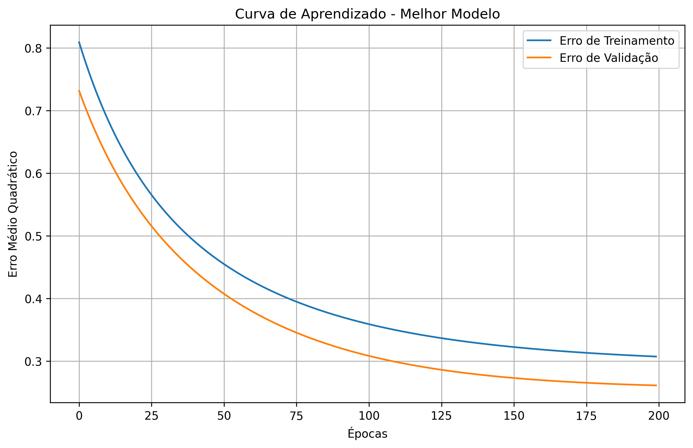
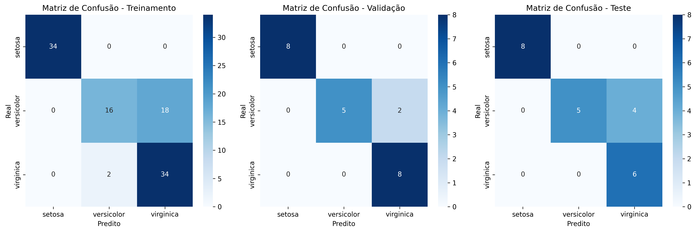

Todos os exercicios foram feitos em Python, utilizando as bibliotecas `numpy`, `pandas`, `matplotlib` e `sklearn`. Os arquivos de código fonte estão disponíveis no repositório do GitHub e no `.zip`, e os resultados dos experimentos estão documentados neste relatório.

# Exercício 1: Perceptron para Classificação do Dataset Iris

## Introdução

O exercicio 1 consiste na implementação de uma rede Perceptron para classificação do conjunto de dados Iris. O dataset contém 150 amostras de flores de iris, sendo 50 de cada uma (Setosa, Virginica e Versicolor). Para cada amostra, foram medidos quatro atributos: comprimento da sépala, largura da sépala, comprimento da pétala e largura da pétala. O objetivo é classificar as amostras em uma das três classes com base nesses atributos.

Conforme o enunciado, o objetivo é treinar uma rede Perceptron para classificar as três diferentes classes, dividindo aleatoriamente os exemplos em subconjuntos ded treinamento (70%), validação (15%) e teste (15%). Além disso, foram testadas diferentes configurações de pesos iniciais e taxas de aprendizado, bem como o impacto da normalização dos dados nos resultados.

## Implementação

A implementação pode ser encontrada no arquivo `exercicio_1.ipynb`. O dataset Iris foi carregado usando a biblioteca `sklearn.datasets`. A normalização dos dados foi feita utilizando o método `StandardScaler` da biblioteca `sklearn.preprocessing`.

## Metodologia

Para a realização dos experimentos, seguimos a seguinte metodologia:

1. **Carregamento e divisão do dataset**: O conjunto de dados Iris foi carregado e dividido em conjuntos de treinamento (70%), validação (15%) e teste (15%).

2. **Experimentos com dados não normalizados**: Foram testadas diferentes combinações de taxas de aprendizado (0.001, 0.01, 0.1) e escalas de inicialização de pesos (0.01, 0.1, 1.0). Para cada configuração, o experimento foi repetido 5 vezes, e a melhor configuração foi selecionada com base na acurácia de validação.

3. **Experimentos com dados normalizados**: Os mesmos experimentos foram repetidos, mas com os dados normalizados utilizando o StandardScaler da biblioteca Scikit-learn.

4. **Avaliação dos resultados**: Os resultados foram avaliados com base nas acurácias de treinamento, validação e teste, bem como nas matrizes de confusão para cada conjunto de dados.

5. **Visualização dos resultados**: Foram gerados gráficos da curva de aprendizado (Erro Médio Quadrático) e das matrizes de confusão para o melhor modelo.

## Resultados e Discussão

### Divisão do Dataset

O dataset Iris foi dividido da seguinte forma:
- Conjunto de treinamento: 104 amostras (70%)
- Conjunto de validação: 23 amostras (15%)
- Conjunto de teste: 23 amostras (15%)

### Experimentos com Dados Não Normalizados

Foram testadas 9 configurações diferentes (3 taxas de aprendizado × 3 escalas de inicialização), cada uma repetida 5 vezes. A melhor configuração obtida foi:

- Taxa de aprendizado: 0.01
- Escala de inicialização: 1.0
- Acurácia de validação: 0.8696 (86.96%)
- Acurácia de teste: 0.8261 (82.61%)

### Experimentos com Dados Normalizados

Os mesmos experimentos foram repetidos com os dados normalizados. A melhor configuração obtida foi:

- Taxa de aprendizado: 0.01
- Escala de inicialização: 0.1
- Acurácia de validação: 0.9130 (91.30%)
- Acurácia de teste: 0.8261 (82.61%)

### Comparação dos Resultados

Comparando os melhores resultados obtidos com e sem normalização:

- **Sem normalização**: 0.8696 (validação), 0.8261 (teste)
- **Com normalização**: 0.9130 (validação), 0.8261 (teste)

Observa-se que a normalização dos dados melhorou a acurácia de validação em aproximadamente 4.34 pontos percentuais, enquanto a acurácia de teste permaneceu a mesma. Isso sugere que a normalização ajudou o modelo a generalizar melhor para o conjunto de validação, mas não teve impacto significativo no conjunto de teste.

### Melhor Configuração Geral

A melhor configuração geral foi obtida com os dados normalizados:

- Normalização: Sim
- Taxa de aprendizado: 0.01
- Escala de inicialização: 0.1
- Épocas: 200
- Acurácia de treinamento: 0.8077 (80.77%)
- Acurácia de validação: 0.9130 (91.30%)
- Acurácia de teste: 0.8261 (82.61%)

### Curva de Aprendizado

A **Figura 1** mostra a curva de aprendizado do melhor modelo mostra a evolução do Erro Médio Quadrático (MSE) ao longo das épocas de treinamento, tanto para o conjunto de treinamento quanto para o conjunto de validação.

<figure>
  
  <figcaption>Figura 1: Curva de Aprendizado</figcaption>
</figure>

Observa-se que o erro diminui consistentemente ao longo das épocas, indicando que o modelo está aprendendo corretamente. Além disso, o erro de validação é ligeiramente menor que o erro de treinamento, o que sugere que o modelo está generalizando bem para dados não vistos.

### Matrizes de Confusão

A **Figura 2** mostra as matrizes de confusão para os conjuntos de treinamento, validação e teste.

<figure>
  
  <figcaption>Figura 2: Matrizes de Confusão</figcaption>
</figure>

Analisando as matrizes de confusão, podemos observar:

1. **Classe Setosa (0)**: O modelo classificou corretamente todas as amostras da classe Setosa em todos os conjuntos (treinamento, validação e teste). Isso indica que a classe Setosa é facilmente separável das outras classes.

2. **Classe Versicolor (1)**: O modelo teve dificuldade em distinguir entre Versicolor e Virginica. No conjunto de treinamento, 18 amostras de Versicolor foram classificadas incorretamente como Virginica. No conjunto de validação, 2 amostras foram classificadas incorretamente, e no conjunto de teste, 4 amostras.

3. **Classe Virginica (2)**: O modelo classificou corretamente a maioria das amostras de Virginica, com apenas 2 amostras classificadas incorretamente como Versicolor no conjunto de treinamento, e nenhuma no conjunto de validação e teste.

Essas observações sugerem que as classes Versicolor e Virginica são mais difíceis de separar, o que é um resultado esperado, considerando que essas duas espécies são mais semelhantes entre si do que em relação à espécie Setosa.

## Conclusões

Com base nos experimentos realizados, podemos concluir que:

1. **Normalização dos dados**: A normalização dos dados melhorou a acurácia de validação, indicando que é uma prática recomendada para este tipo de problema.

2. **Taxa de aprendizado e inicialização de pesos**: A taxa de aprendizado de 0.01 e a escala de inicialização de 0.1 produziram os melhores resultados com os dados normalizados. Taxas de aprendizado muito altas (0.1) ou muito baixas (0.001) resultaram em desempenho inferior.

3. **Separabilidade das classes**: A classe Setosa é facilmente separável das outras classes, enquanto as classes Versicolor e Virginica são mais difíceis de distinguir, o que é consistente com as características biológicas dessas espécies.

4. **Desempenho do Perceptron**: O Perceptron, mesmo sendo um modelo relativamente simples, conseguiu atingir uma acurácia de teste de 82.61%, o que é um resultado satisfatório para este problema de classificação multiclasse.

5. **Convergência do algoritmo**: A curva de aprendizado mostra que o algoritmo convergiu adequadamente, com o erro diminuindo consistentemente ao longo das épocas.

Em resumo, o Perceptron mostrou-se eficaz para a classificação do dataset Iris, especialmente quando utilizado com dados normalizados e parâmetros adequados. No entanto, a dificuldade em separar completamente as classes Versicolor e Virginica sugere que modelos mais complexos, como redes neurais com camadas ocultas, poderiam potencialmente alcançar resultados ainda melhores.