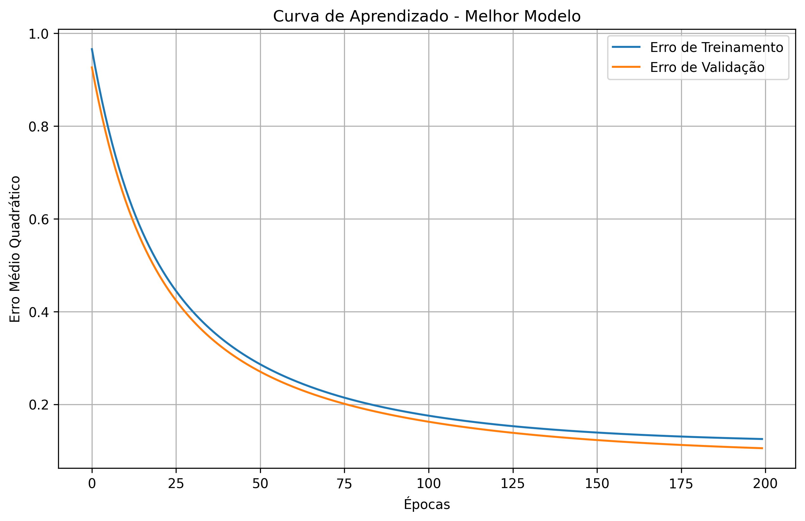
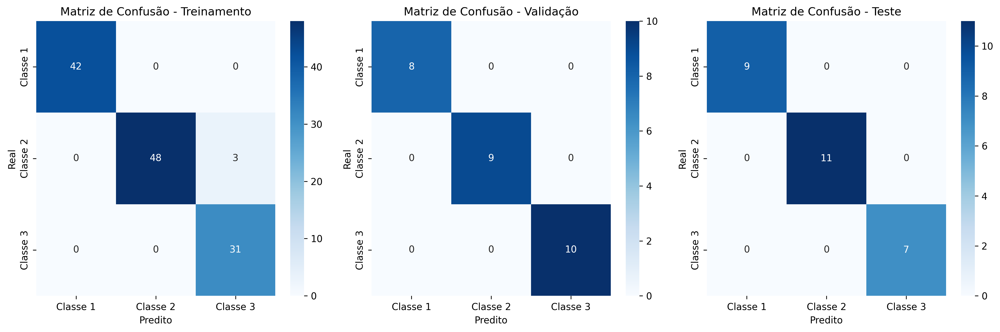

# Exercício 2: Perceptron para Classificação do Dataset Wine

## Introdução

O exercício 2 consiste na implementação de uma rede Perceptron para classificação do conjunto de dados Wine do UCI Machine Learning Repository. O dataset Wine contém os resultados de uma análise química de vinhos cultivados na mesma região da Itália, mas derivados de três diferentes cultivares.

O objetivo é identificar os atributos e classes do problema, e realizar experimentos similares aos do exercício 1, incluindo treinar uma rede Perceptron para reconhecer as diferentes classes, dividindo aleatoriamente os exemplos em subconjuntos de treinamento (70%), validação (15%) e teste (15%). Além disso, foram testadas diferentes configurações de pesos iniciais e taxas de aprendizado, bem como o impacto da normalização dos dados nos resultados.

## Identificação dos Atributos e Classes

De acordo com a documentação do dataset Wine, os dados possuem as seguintes características:

### Classes
O dataset contém 3 classes, representando três diferentes cultivares de vinho:
- Classe 1: 59 amostras
- Classe 2: 71 amostras
- Classe 3: 48 amostras

### Atributos
O dataset contém 13 atributos contínuos, que são os resultados de análises químicas:
1. Alcohol (Álcool)
2. Malic acid (Ácido málico)
3. Ash (Cinzas)
4. Alcalinity of ash (Alcalinidade das cinzas)
5. Magnesium (Magnésio)
6. Total phenols (Fenóis totais)
7. Flavanoids (Flavonoides)
8. Nonflavanoid phenols (Fenóis não flavonoides)
9. Proanthocyanins (Proantocianinas)
10. Color intensity (Intensidade da cor)
11. Hue (Tonalidade)
12. OD280/OD315 of diluted wines (OD280/OD315 de vinhos diluídos)
13. Proline (Prolina)

## Implementação

A implementação pode ser encontrada no arquivo `exercicio_2.ipynb`. O dataset foi carregado manualmente a partir do arquivo `wine.data` do UCI Machine Learning Repository.

## Metodologia

Para a realizazção dos experimentos, foi seguido a metodologia semelhante à do exercício 1:

1. **Carregamento do dataset**: O conjunto de dados Wine foi carregado a partir do arquivo wine.data do UCI Machine Learning Repository.

2. **Divisão do dataset**: Os dados foram divididos em conjuntos de treinamento (70%), validação (15%) e teste (15%).

3. **Experimentos com dados não normalizados**: Foram testadas diferentes combinações de taxas de aprendizado (0.001, 0.01, 0.1) e escalas de inicialização de pesos (0.01, 0.1, 1.0). Para cada configuração, o experimento foi repetido 5 vezes, e a melhor configuração foi selecionada com base na acurácia de validação.

4. **Experimentos com dados normalizados**: Os mesmos experimentos foram repetidos, mas com os dados normalizados utilizando o StandardScaler da biblioteca Scikit-learn.

5. **Avaliação dos resultados**: Os resultados foram avaliados com base nas acurácias de treinamento, validação e teste, bem como nas matrizes de confusão para cada conjunto de dados.

6. **Visualização dos resultados**: Foram gerados gráficos da curva de aprendizado (Erro Médio Quadrático) e das matrizes de confusão para o melhor modelo.

## Resultados e Discussão

### Divisão do Dataset

O dataset Wine foi dividido da seguinte forma:
- Conjunto de treinamento: 124 amostras (70%)
- Conjunto de validação: 27 amostras (15%)
- Conjunto de teste: 27 amostras (15%)

### Experimentos com Dados Não Normalizados

Foram testadas 9 configurações diferentes (3 taxas de aprendizado × 3 escalas de inicialização), cada uma repetida 5 vezes. A melhor configuração obtida foi:

- Taxa de aprendizado: 0.001
- Escala de inicialização: 0.01
- Acurácia de validação: 0.2963 (29.63%)
- Acurácia de teste: 0.3333 (33.33%)

Observamos que sem normalização, o desempenho do Perceptron foi muito baixo, com acurácias próximas ao acaso. Isso sugere que as diferentes escalas dos atributos estão afetando significativamente o aprendizado do modelo.

### Experimentos com Dados Normalizados

Os mesmos experimentos foram repetidos com os dados normalizados. A melhor configuração obtida foi:

- Taxa de aprendizado: 0.01
- Escala de inicialização: 0.01
- Acurácia de validação: 1.0000 (100.00%)
- Acurácia de teste: 1.0000 (100.00%)

Com a normalização dos dados, o Perceptron conseguiu atingir 100% de acurácia tanto no conjunto de validação quanto no conjunto de teste. Isso demonstra a importância crucial da normalização para este dataset específico.

### Comparação dos Resultados

Comparando os melhores resultados obtidos com e sem normalização:

- **Sem normalização**: 0.2963 (validação), 0.3333 (teste)
- **Com normalização**: 1.0000 (validação), 1.0000 (teste)

A diferença é extremamente significativa, com uma melhoria de mais de 70 pontos percentuais na acurácia. Isso indica que a normalização é essencial para o bom desempenho do Perceptron neste dataset.

### Melhor Configuração Geral

A melhor configuração geral foi obtida com os dados normalizados:

- Normalização: Sim
- Taxa de aprendizado: 0.01
- Escala de inicialização: 0.01
- Épocas: 200
- Acurácia de treinamento: 0.9758 (97.58%)
- Acurácia de validação: 1.0000 (100.00%)
- Acurácia de teste: 1.0000 (100.00%)

### Curva de Aprendizado

A **Figura 1** mostra a curva de aprendizado do melhor modelo, que ilustra a evolução do Erro Médio Quadrático (MSE) ao longo das épocas de treinamento, tanto para o conjunto de treinamento quanto para o conjunto de validação.

<figure>
  
  <figcaption>Figura 1: Curva de Aprendizado</figcaption>
</figure>

Observa-se que o erro diminui rapidamente nas primeiras épocas e continua a diminuir de forma mais gradual ao longo do treinamento. O erro de validação é ligeiramente menor que o erro de treinamento, o que sugere que o modelo está generalizando bem para dados não vistos.

### Matrizes de Confusão

A **Figura 2** mostra as matrizes de confusão para os conjuntos de treinamento, validação e teste.

<figure>
  
  <figcaption>Figura 2: Matrizes de Confusão</figcaption>
</figure>

Analisando as matrizes de confusão, podemos observar:

1. **Classe 1**: O modelo classificou corretamente todas as amostras da classe 1 em todos os conjuntos (treinamento, validação e teste).

2. **Classe 2**: No conjunto de treinamento, 3 amostras da classe 2 foram classificadas incorretamente como classe 3. No entanto, nos conjuntos de validação e teste, todas as amostras foram classificadas corretamente.

3. **Classe 3**: O modelo classificou corretamente todas as amostras da classe 3 em todos os conjuntos.

Essas observações indicam que o modelo teve um desempenho excelente, com apenas alguns erros no conjunto de treinamento, e perfeição nos conjuntos de validação e teste.

## Conclusões

Com base nos experimentos realizados, podemos concluir que:

1. **Normalização dos dados**: A normalização dos dados é absolutamente crucial para o bom desempenho do Perceptron no dataset Wine. Sem normalização, o modelo teve um desempenho próximo ao acaso, enquanto com normalização, atingiu 100% de acurácia.

2. **Taxa de aprendizado e inicialização de pesos**: A taxa de aprendizado de 0.01 e a escala de inicialização de 0.01 produziram os melhores resultados com os dados normalizados.

3. **Separabilidade das classes**: As classes do dataset Wine são linearmente separáveis quando os dados são normalizados, permitindo que um modelo simples como o Perceptron alcance 100% de acurácia.

4. **Desempenho do Perceptron**: O Perceptron, mesmo sendo um modelo relativamente simples, conseguiu atingir uma acurácia perfeita neste problema de classificação multiclasse, desde que os dados estejam normalizados.

5. **Convergência do algoritmo**: A curva de aprendizado mostra que o algoritmo convergiu adequadamente, com o erro diminuindo consistentemente ao longo das épocas.

Em resumo, o Perceptron mostrou-se extremamente eficaz para a classificação do dataset Wine quando utilizado com dados normalizados e parâmetros adequados. A normalização dos dados foi o fator mais importante para o sucesso do modelo, destacando a importância do pré-processamento adequado dos dados em problemas de aprendizado de máquina.

## Comparação com o Dataset Iris (Exercício 1)

Comparando os resultados obtidos com o dataset Wine com os do dataset Iris (Exercício 1), podemos observar:

1. **Impacto da normalização**: A normalização teve um impacto muito mais significativo no dataset Wine do que no Iris. No Wine, a normalização melhorou a acurácia de cerca de 30% para 100%, enquanto no Iris, a melhoria foi mais modesta.

2. **Separabilidade das classes**: As classes do dataset Wine são mais facilmente separáveis (quando normalizadas) do que as do Iris, onde as classes Versicolor e Virginica apresentavam alguma sobreposição.

3. **Complexidade do problema**: O dataset Wine tem mais atributos (13) do que o Iris (4), mas com a normalização adequada, o problema se tornou mais fácil de resolver.

4. **Desempenho geral**: O Perceptron conseguiu um desempenho perfeito no dataset Wine normalizado, enquanto no Iris, mesmo com normalização, a acurácia máxima foi de cerca de 91% no conjunto de validação e 83% no conjunto de teste.

Essas observações destacam como diferentes datasets podem apresentar desafios distintos para algoritmos de aprendizado de máquina, e como técnicas simples de pré-processamento, como a normalização, podem ter impactos drasticamente diferentes dependendo da natureza dos dados.