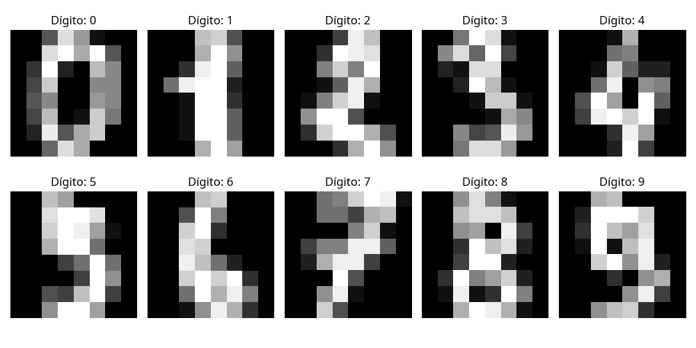

# Exercício 3: Redes Neurais para Classificação do Dataset Digits

## Introdução

O exercício 3 consiste na implementação e comparação de diferentes arquiteturas de redes neurais para classificação do conjunto de dados Digits do scikit-learn. O dataset Digits contém imagens de dígitos manuscritos (0-9) em baixa resolução (8x8 pixels), totalizando 1797 amostras.

Conforme solicitado, o objetivo é realizar experimentos de classificação com diferentes arquiteturas de redes neurais, comparando seus desempenhos e configurações de hiperparâmetros. Para isso, foram implementadas e avaliadas cinco arquiteturas diferentes:

1. MLP Simples (1 camada oculta)
2. MLP Profunda (3 camadas ocultas)
3. CNN Simples (1 camada convolucional)
4. CNN Profunda (2 camadas convolucionais)
5. MLP com otimizador SGD (1 camada oculta)

## Dataset Digits

O dataset Digits do scikit-learn é um conjunto de dados de dígitos manuscritos (0-9) em baixa resolução, frequentemente utilizado para tarefas de classificação em aprendizado de máquina.

As principais características do dataset são:

- **Número total de amostras**: 1797
- **Dimensão de cada imagem**: 8x8 pixels
- **Dimensão dos dados de entrada**: 64 (imagens achatadas em vetores)
- **Número de classes**: 10 (dígitos de 0 a 9)

A **Figura 1** mostra exemplos de imagens do dataset Digits.

<figure>
  
  <figcaption>Figura 1: Exemplos do Dataset Digits</figcaption>
</figure>

### Divisão do Dataset

O dataset foi dividido em três conjuntos:

- **Treinamento**: 1257 amostras (70%)
- **Validação**: 270 amostras (15%)
- **Teste**: 270 amostras (15%)

A distribuição das classes em cada conjunto foi verificada para garantir uma representação equilibrada de todos os dígitos.

## Arquiteturas de Redes Neurais Implementadas

### 1. MLP Simples

Uma rede neural feedforward simples com apenas uma camada oculta.

**Arquitetura**:
- Camada de entrada: 64 neurônios (correspondentes aos 64 pixels)
- Camada oculta: 100 neurônios com ativação ReLU
- Camada de saída: 10 neurônios com ativação softmax (um para cada classe)

**Hiperparâmetros**:
- Otimizador: Adam
- Função de perda: Entropia cruzada categórica
- Batch size: 32
- Early stopping com paciência de 10 épocas

### 2. MLP Profunda

Uma rede neural feedforward mais profunda com três camadas ocultas e técnicas de regularização.

**Arquitetura**:
- Camada de entrada: 64 neurônios
- Primeira camada oculta: 128 neurônios com ativação ReLU + BatchNormalization + Dropout (0.3)
- Segunda camada oculta: 64 neurônios com ativação ReLU + BatchNormalization + Dropout (0.3)
- Terceira camada oculta: 32 neurônios com ativação ReLU + BatchNormalization
- Camada de saída: 10 neurônios com ativação softmax

**Hiperparâmetros**:
- Otimizador: Adam
- Função de perda: Entropia cruzada categórica
- Batch size: 32
- Early stopping com paciência de 10 épocas

### 3. CNN Simples

Uma rede neural convolucional simples com uma camada convolucional.

**Arquitetura**:
- Camada de entrada: Imagens 8x8x1
- Camada convolucional: 32 filtros de tamanho 3x3 com ativação ReLU e padding 'same'
- Camada de pooling: MaxPooling 2x2
- Flatten
- Camada densa: 64 neurônios com ativação ReLU
- Camada de saída: 10 neurônios com ativação softmax

**Hiperparâmetros**:
- Otimizador: Adam
- Função de perda: Entropia cruzada categórica
- Batch size: 32
- Early stopping com paciência de 10 épocas

### 4. CNN Profunda

Uma rede neural convolucional mais profunda com duas camadas convolucionais e técnicas de regularização.

**Arquitetura**:
- Camada de entrada: Imagens 8x8x1
- Primeira camada convolucional: 32 filtros de tamanho 3x3 com ativação ReLU e padding 'same' + BatchNormalization
- Segunda camada convolucional: 64 filtros de tamanho 3x3 com ativação ReLU e padding 'same' + BatchNormalization
- Camada de pooling: MaxPooling 2x2
- Dropout (0.25)
- Flatten
- Camada densa: 128 neurônios com ativação ReLU + BatchNormalization
- Dropout (0.5)
- Camada de saída: 10 neurônios com ativação softmax

**Hiperparâmetros**:
- Otimizador: Adam
- Função de perda: Entropia cruzada categórica
- Batch size: 32
- Early stopping com paciência de 10 épocas

### 5. MLP com SGD

Uma rede neural feedforward simples com otimizador SGD em vez de Adam.

**Arquitetura**:
- Camada de entrada: 64 neurônios
- Camada oculta: 100 neurônios com ativação ReLU
- Camada de saída: 10 neurônios com ativação softmax

**Hiperparâmetros**:
- Otimizador: SGD com learning rate=0.01 e momentum=0.9
- Função de perda: Entropia cruzada categórica
- Batch size: 32
- Early stopping com paciência de 10 épocas

## Resultados e Discussão

### Comparação de Desempenho

A tabela abaixo apresenta um resumo comparativo do desempenho das diferentes arquiteturas:

| Modelo | Arquitetura | Parâmetros | Acurácia no Teste | Tempo de Treinamento (s) | Épocas |
|--------|-------------|------------|-------------------|--------------------------|--------|
| MLP Simples | 1 camada oculta (100 neurônios) | 7.510 | 97,04% | 15,15 | 88 |
| MLP Profunda | 3 camadas ocultas (128-64-32) | 19.882 | 98,52% | 13,26 | 50 |
| CNN Simples | 1 camada conv (32 filtros) | 33.802 | 98,15% | 9,87 | 41 |
| CNN Profunda | 2 camadas conv (32-64 filtros) | 152.202 | 99,26% | 23,48 | 48 |
| MLP com SGD | 1 camada oculta (100 neurônios) | 7.510 | 97,41% | 11,14 | 65 |

### Curvas de Aprendizado

As Figuras 2, 3, 4, 5 e 6 exibem as curvas de aprendizado que mostram a evolução da acurácia e da perda (loss) ao longo das épocas de treinamento para cada modelo:

